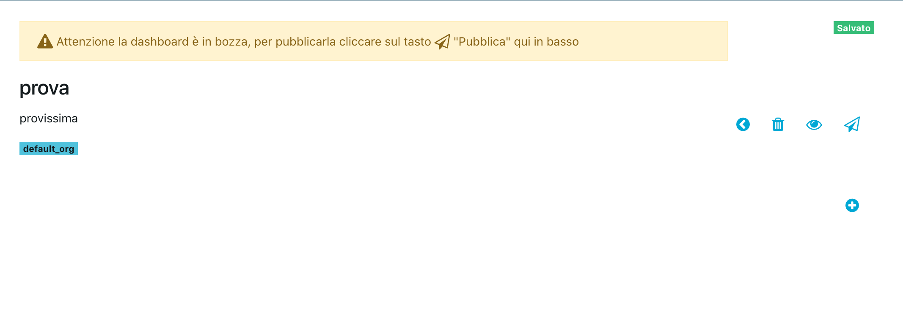
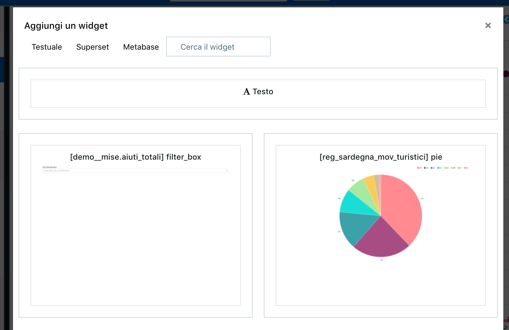
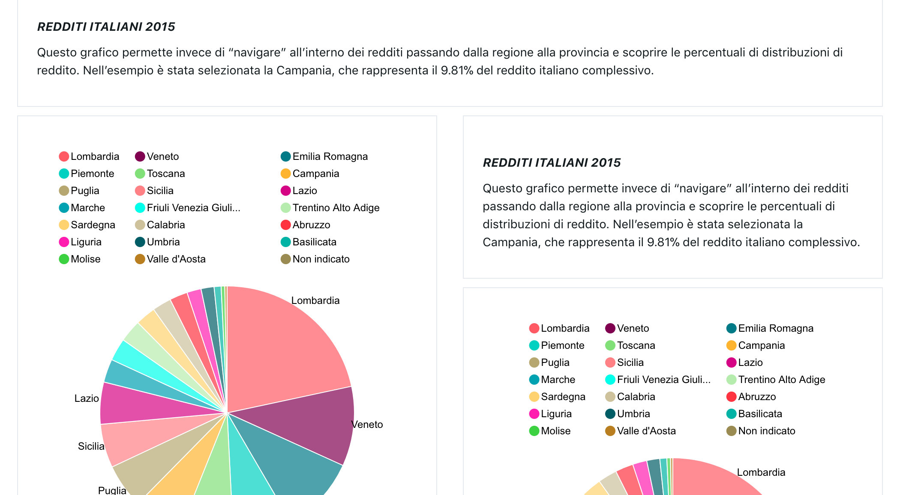
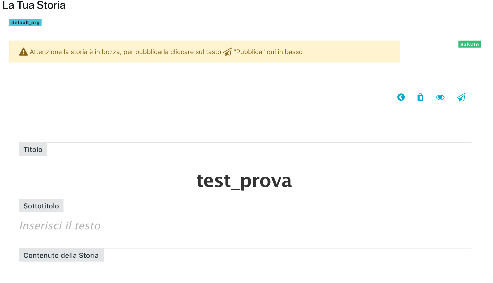
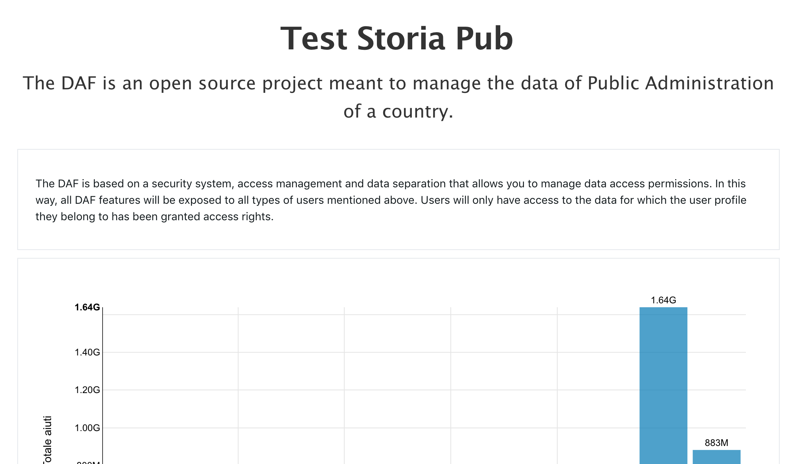

***************************************
Pubblicazione di Dashboard e Data Story
***************************************

Dashboard e data story sono due elementi chiave del DAF. In particolare, entrambe forniscono all'utente una visione di insieme degli insights e delle conclusioni tratte dall'analisi dei singoli dataset.

Per creare una dashboard o una data story è necessario registrarsi ed entrare nell'area privata del Dataportal. Quindi, dal menù principale compaiono le voci *Dashboard* e *Storie*.

================
Le mie Dashboard
================

Le dashboard raccolgono elementi testuali e rappresentazioni dei dati realizzate con gli strumenti di analisi quali *Superset* e *Metabase*.

Scegliendo l'opzione *Dashboard*, si attiva la funzionalità che mostra tutte le dashboard create dall'utente, dagli utenti appartenenti alla sua stessa organizzazione e quelle la cui visibilità è aperta a tutti. L'elenco delle dashboard può essere filtrato, tramite le parole contenute nei titoli delle dashboard di interesse, usufruendo dell'apposita barra di ricerca.

Ogni dashboard è indicata da una *card* grazie cui si individuano subito:

- Il *titolo*;
- Il *nome utente* dell'autore;
- Il *cartellino* che la definisce come pubblica o privata;
- Il numero di *widget* di cui si compone;
- Il *dataset* cui fa riferimento.

Cliccando sul titolo si ha la possibilità di visualizzare la dashboard. Immediatamente sotto al titolo compare un tag che indica l'organizzazione cui la dashboard appartiene.

Quindi, si ha la possibilità di modificare la dashboard. Una volta effettuate le modifiche, per pubblicarla ed uscire dalla modalità *bozza*, occorre salvare e pubblicare utilizzando l'icona apposita. Le modalità di *edit* corrispondono a quelle di creazione e sono riportate nel paragrafo seguente.

================================
Creazione di una nuova Dashboard
================================

Per creare una nuova dashboard, trovandosi su *Le mie dashboard*, è sufficiente premere sull'icona con il ``+`` che si trova alla destra della barra di ricerca.

Altrimenti, dal menù principale, si clicca su *Crea* scegliendo di creare una dashboard.

In entrambi i casi è chiesto di inserire delle informazioni di base sulla nuova dashboard:

- Il *titolo*;
- Il *sottotitolo*;
- Se ha *visibilità* privata o pubblica, nel caso di visibilità privata è richiesto indicare l'organizzazione di riferimento.

Quindi, appare la seguente schermata su cui iniziare a lavorare.

Per iniziare a popolare la dashboard si preme il tasto *Aggiungi* attivando la funzionalità di aggiungere un widget. 

Si definisce **widget** della dashboard un elemento di testo o una slice importata da `Superset <https://github.com/italia/daf-docs/blob/master/manutente/datascience/superset.rst>`_ o `Metabase <http://daf-docs.readthedocs.io/en/latest/manutente/datascience/metabase.html>`_. I widget vengono selezionati tra quelli esistenti a cui si ha accesso e che sono mostrati nella finestra seguente.
	

	
Come visibile dall'immagine, si ha la possibilità di scegliere la tipologia di widget (*Testo*, *Metabse*, *Superset*) e di   effettuare ricerche basate sul titolo delle slices/grafici in elenco.

Al momento i widget inseriti sono tra loro indipendenti. Perciò, eventuali widget corrispondenti a slices che effettuano filtri su *Superset* non hanno lo stesso potere sulla dashboard creata sul *Dataportal*.

Durante il processo di creazione della dashboard è possible visualizzarne l'*anteprima*. Mentre, per condividerla è necessario cliccare sul tasto *Pubblica* che permette di condividere il lavoro con l'organizzazione dell'utente o con tutti. 

Per eliminare una dashboard occorre entrare in modalità *modifica* della storia e premere il pulsante *Elimina*.

A seguire un esempio di dashboard.

================
Le mie storie
================

Una Storia, detta anche Data Story, è una modalità di presentazione, simile ad un blog post, che alterna parti testuali a grafici/widget realizzati tramite Superset.

Per visualizzare le proprie storie si sceglie, dal menù principale, la sezione *Storie*. Questa mostra tutte le storie create dall'utente, dagli utenti appartenenti alla sua stessa organizzazione e quelle la cui visibilità è aperta a tutti. Analogamente a quanto accade per *Le mie dashboard*, l'elenco mostrato può essere filtrato usufruendo dell'apposita barra di ricerca.

Ogni storia è indicata da una *card* su cui appaiono:

- Il *titolo*;
- Il *nome utente* dell'autore;
- Il *cartellino* che la definisce come pubblica o privata.

================================
Creazione di una nuova storia
================================

Per creare una storia, trovandosi su *Le mie storie*, è sufficiente premere sull'icona con il ``+`` che si trova alla destra della barra di ricerca.

Oppure, dal menù principale, si clicca su *Crea* scegliendo di creare una storia.

Quindi si inseriscono le informazioni relative alla storia quali:

- *Titolo*;
- *Privata* o *pubblica*.

Una volta inserite queste informazioni appare la seguente schermata su cui iniziare a lavorare.

Si è nella modalità di editing della storia. Pertanto è possibile:

- Modificare il *titolo*;
- Inserire il *sottotitolo*;
- Lavorare al contenuto della storia.

Il contenuto della storia è popolato inserendo i widget con le stesse modalità indicate per la dashboard. 
Per eliminare una dashboard occorre entrare in modalità *modifica* della storia e premere il pulsante *Elimina*.
A seguire un esempio di data story.

